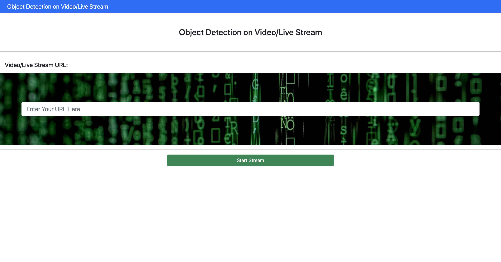
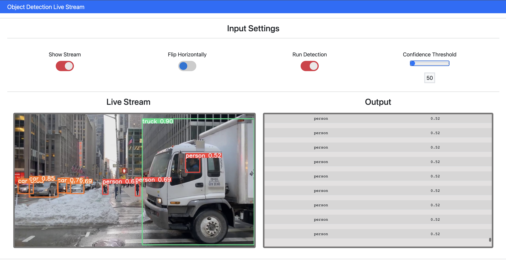

# Live Object Detection Web Application

The Live Object Detection web application is a Flask-based application that allows users to perform real-time object detection on a live video stream or a video URL. It utilizes the YOLOv8 (You Only Look Once) model for object detection and provides an interactive interface to control various settings for the video stream and detection.


## Screenshots

 | 
:-----------------------------------------------:|:-----------------------------------------------:
Homepage                                         | Dashboard


## Table of Contents
- [Prerequisites](#prerequisites)
- [Installation](#installation)
- [Usage](#usage)
- [How it Works](#how-it-works)
- [Control Features](#control-features)
- [Technologies Used](#technologies-used)
## Prerequisites

Before running the Live Object Detection web application, ensure you have the following prerequisites installed on your system:

- Python 3.10
- pip (Python package manager)

## Installation

1. Clone the repository to your local machine:

   ```
   git clone https://github.com/yourusername/live-object-detection.git
   ```

2. Navigate to the project directory:

   ```
   cd live-object-detection
   ```

3. Install the required Python packages using `pip`:

   ```
   pip install -r requirements.txt
   ```

## Usage

1. Run the Flask application:

   ```
   python app.py
   ```

2. Open your web browser and go to `http://localhost:5000` to access the application's homepage.

3. On the homepage, enter the URL of the video/live stream you want to process.

4. Click on the "Start Stream" button to initiate the video stream processing.

5. The video stream with real-time object detection will be displayed on the index page.

6. Use the control features (checkboxes and slider) to modify the behavior of the video stream and object detection.

7. To stop the video stream processing, click the "Back to Homepage" button.

## How it Works

The Live Object Detection web application is built using the Flask framework and utilizes OpenCV for video stream processing. The YOLOv8 model is employed for real-time object detection.

1. When the user enters the video/live stream URL and clicks "Start Stream," the `VideoStreaming` class initiates the video stream processing.

2. The video stream is obtained from the specified URL using the `cv2.VideoCapture` function from OpenCV.

3. The user can control various settings, such as previewing the stream, flipping the video horizontally, and enabling object detection.

4. When object detection is enabled, the YOLOv8 model predicts the objects in each video frame with a specified confidence threshold.

5. The detected objects and their confidence scores are displayed in real-time on the web page using Socket.IO for dynamic updates.

## Control Features

The application provides the following control features:

- **Show Stream**: This checkbox allows users to toggle the preview of the video stream. When checked, the stream is visible; otherwise, a placeholder image is displayed.

- **Flip Horizontally**: This checkbox allows users to flip the video stream horizontally. When checked, the video will be horizontally mirrored.

- **Run Detection**: This checkbox enables or disables real-time object detection. When checked, the YOLOv8 model performs object detection on each frame.

- **Confidence Threshold**: Users can adjust the confidence threshold for object detection using the slider. The confidence threshold determines the minimum confidence required for an object to be detected.

## Technologies Used

- Python 3
- Flask (Web Framework)
- OpenCV (cv2) (Video Stream Processing)
- YOLOv8 (You Only Look Once) Model for Object Detection
- Socket.IO (For Real-Time Updates)
- Bootstrap (Frontend Styling)
- HTML/CSS/JavaScript
